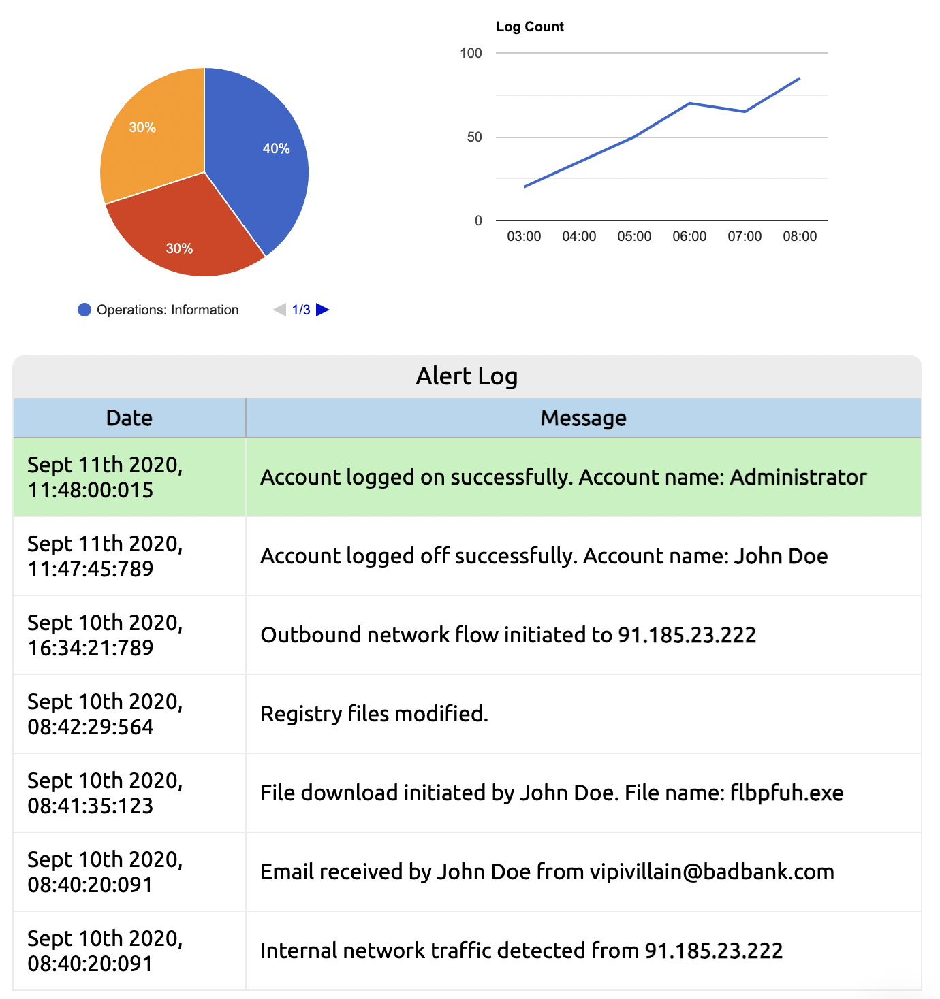
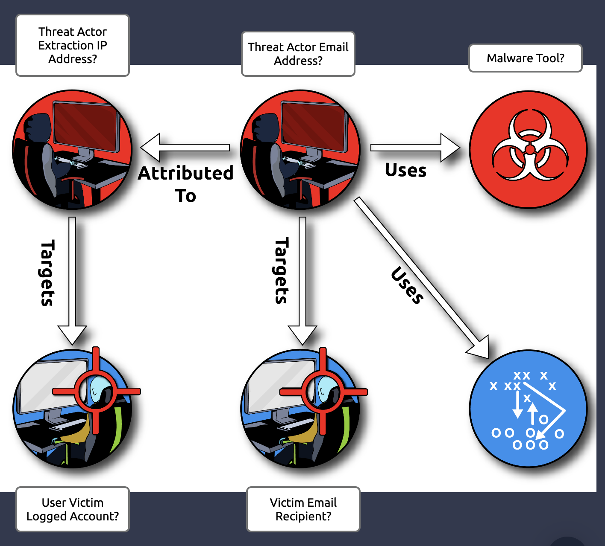
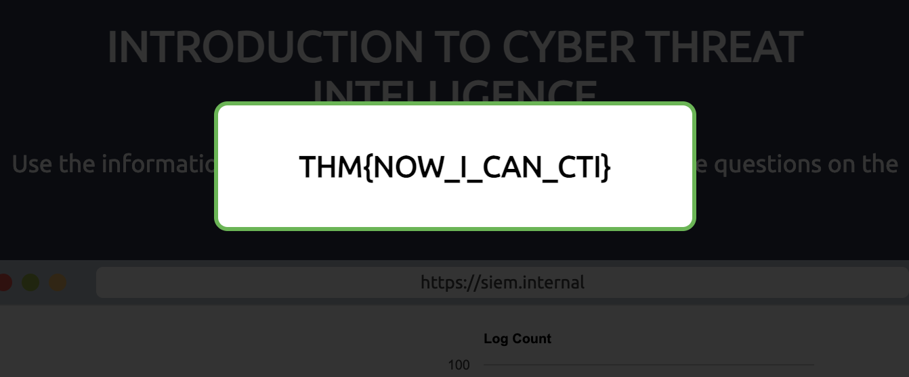

# INTRODUCTION TO CYBER THREAT INTELLIGENCE

## Information from the SIEM Dashboard 

## Threat Intel Flow chart

## Questions

1. What was the threat actor's extraction IP address?

 - 91.185.23.222

2. What was the threat actor's email address?

 - vipivillain@badbank.com

3. What software tool was used in the extraction?

 - flbpfuh.exe

4. What user account was logged in by the threat actor?

 - Administrator

5. Who was the targeted victim?

 - John Doe

6. Put that all together and we get our flag!

