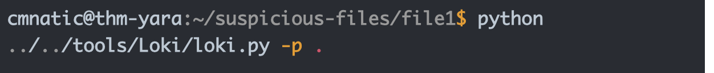
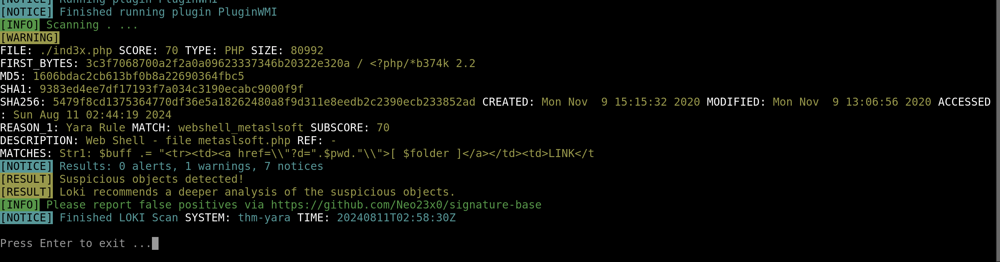

# Scenario

You are the security analyst for a mid-size law firm. A co-worker discovered suspicious files on a web server within your organization. These files were discovered while performing updates to the corporate website. The files have been copied to your machine for analysis. The files are located in the suspicious-files directory. Use Loki to answer the questions below.

1. Scan file 1. Does Loki detect this file as suspicious/malicious or benign?

  Use below command

 

 - Suspicious
