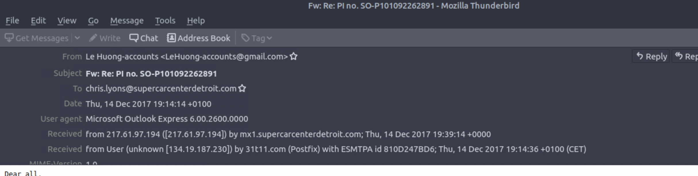
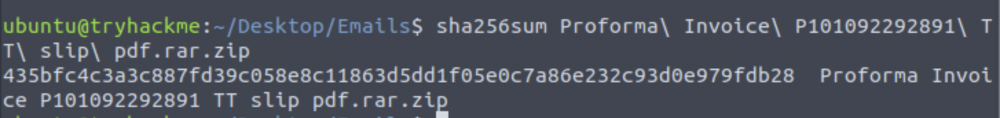

# Scenario

You are a SOC Analyst. Several suspicious emails have been forwarded to you from other coworkers. You must obtain details from each email to triage the incidents reported.

Analyze Email2.eml found on the VM attached to Task 5 and use the information to answer the questions.

1. According to Email2.eml, what is the recipient's email address?

 - 

2. From Talos Intelligence, the attached file can also be identified by the Detection Alias that starts with an H...

 - HIDDENEXT/Worm.Gen
 
I downloaded the attachment, then got the SHA256 hash from it by opening a terminal and typing “sha256sum filename

Once you have the hash, search via it in Cisco Talos

